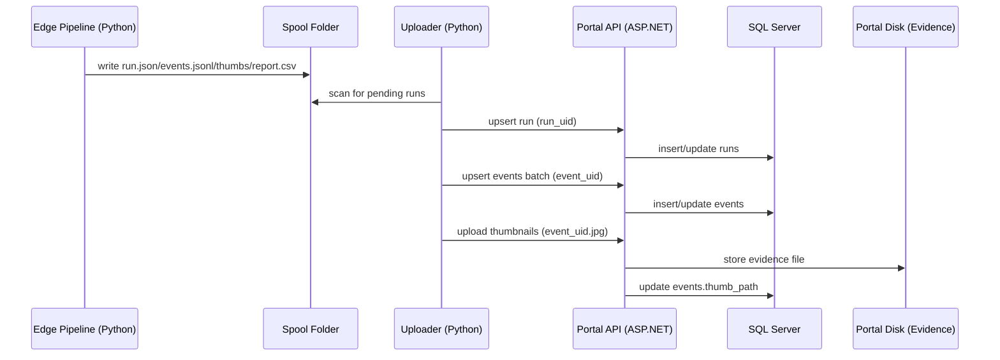

# Portal Architecture (Edge → Uploader → Website)

This document makes the portal/website integration concrete.

The repo you are in is the **edge pipeline** (Python). The portal website is a
separate service (ASP.NET Core + SQL Server) that ingests edge outputs via an
uploader.

## Goals (MVP)

- Show traffic crossing events per camera/day with thumbnails.
- Allow human review per event:
  - `Qualified`: `Yes` / `No` (default: pending)
  - `notes` (optional)
- Export reviewed labels for later training of an automatic classifier.

## Components

1. **Edge pipeline (this repo)**
- Input: MP4 or RTSP
- Output:
  - annotated video (optional)
  - spool run folder (recommended for portal ingestion)

2. **Spool (filesystem-first)**
- Written by the edge pipeline.
- Contents per run:
  - `run.json`
  - `events.jsonl`
  - `report.csv` (human-readable)
  - `thumbs/<event_uid>.jpg` (optional)

3. **Uploader (edge-side async process)**
- Reads spool folders and pushes:
  - run metadata
  - event records
  - thumbnails
- Must be idempotent (safe to retry).

4. **Portal API + Website**
- ASP.NET Core API with SQL Server for metadata.
- Thumbnails stored on portal disk (evidence folder).
- Website UI for dashboards and human review.

## Data Flow (Sequence)

## Idempotency Rules

- `run_uid` uniquely identifies a run. Upsert is keyed by `run_uid`.
- `event_uid` uniquely identifies an event. Upsert is keyed by `event_uid`.
- Thumbnail upload is keyed by `event_uid`:
  - safe behavior: if file exists and size matches, return 200/204 without rewriting
  - if missing, write file then update DB

## Portal DB Schema (MVP)

### `runs`

- `run_uid` (PK)
- `site_id`, `camera_id`
- `started_at_utc`, `ended_at_utc` (optional)
- `source_type`, `source_value`
- `model_version`, `cfg_version`
- `line_mode`, `line_id`
- `fps`, `frame_width`, `frame_height`
- `health_summary_json` (JSON)
- `report_csv_relpath` (optional)

### `events`

- `event_uid` (PK)
- `run_uid` (FK)
- `site_id`, `camera_id`
- `occurred_at_utc`
- `frame_index`, `video_time_s`
- `direction` (`A_TO_B` / `B_TO_A`)
- `track_id`
- `class_id`, `class_name`, `confidence`
- `bbox_json` (int[4] as JSON)
- `thumb_path` (portal disk path, optional)

### `event_reviews`

- `event_uid` (PK, FK -> events)
- `review_status` (`PENDING`, `QUALIFIED`, `NOT_QUALIFIED`)
- `reviewed_at_utc` (nullable)
- `reviewed_by` (nullable)
- `notes` (nullable)

### `camera_criteria`

This is where you store what "Qualified" means for each camera.

- `site_id`, `camera_id` (composite PK)
- `criteria_title`
- `criteria_description` (text/markdown)

## Portal API Endpoints (MVP Contract)

Authentication (MVP):

- `X-API-Key: <secret>` header for uploader requests.

Endpoints:

- `POST /api/runs/upsert`
  - Upsert by `run_uid`.
- `POST /api/events/upsert`
  - Batch upsert by `event_uid`.
- `POST /api/events/{event_uid}/thumbnail`
  - `multipart/form-data` upload.
- `POST /api/events/{event_uid}/review`
  - Set `Qualified Yes/No` + notes.
- `GET /api/events`
  - Filters: site/camera/date/direction/class/review status.
- `GET /api/events/{event_uid}/thumbnail`
  - Serve image for UI.
- `GET /api/dashboard/summary`
  - Aggregates counts and review stats.

## UI Pages (MVP)

- Dashboard (summary + filters)
- Runs list
- Event browser (table/grid)
- Review queue (fast Yes/No + notes)
- Export reviewed labels (CSV)

## Notes About “Specific Vehicle Characteristics”

In v1, the edge model detects vehicle subclasses (truck/tronton/etc).

The "specific characteristics" (e.g. carrying waste paper vs bricks) are handled
by:

- human review in portal: `Qualified Yes/No` (+ notes)
- per-camera criteria text in `camera_criteria`

Later, those human labels can train a dedicated classifier so the portal can
auto-suggest `Qualified` while keeping human review as source of truth.

