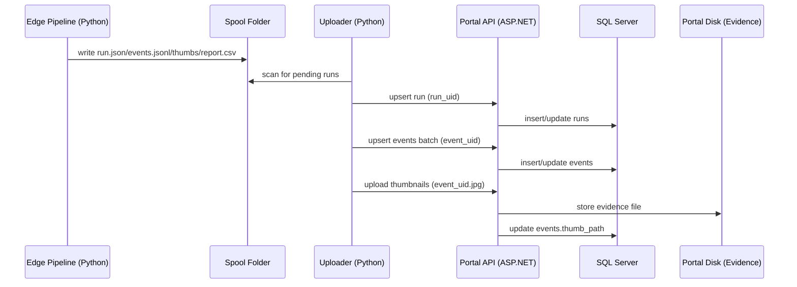

# Portal Legacy Reference

This is the canonical portal document for the repo.

It merges the previous architecture note and the portal-local README so the
older ASP.NET portal surface is documented in one place.

Important status note:

- the FastAPI edge service is the preferred MVP operator-facing surface,
- the ASP.NET `portal/` app is now a secondary or legacy path,
- keep this document for compatibility, migration, and local portal work,
  not as the primary day-one deployment guide.

The repo you are in is the **edge pipeline** (Python). The `portal/` website is
a separate ASP.NET Core service that ingests edge outputs via an uploader.

## Goals (MVP)

- Show traffic crossing events per camera/day with thumbnails.
- Allow human review per event:
  - `Qualified`: `Yes` / `No` (default: pending)
  - `notes` (optional)
- Export reviewed labels for later training of an automatic classifier.

## Components

1. **Edge pipeline (this repo)**
- Input: MP4 or RTSP
- Output:
  - annotated video (optional)
  - spool run folder (recommended for portal ingestion)

2. **Spool (filesystem-first)**
- Written by the edge pipeline.
- Contents per run:
  - `run.json`
  - `events.jsonl`
  - `report.csv` (human-readable)
  - `thumbs/<event_uid>.jpg` (optional)

3. **Uploader (edge-side async process)**
- Reads spool folders and pushes:
  - run metadata
  - event records
  - thumbnails
- Must be idempotent (safe to retry).

4. **Portal API + Website**
- ASP.NET Core API with SQL Server for metadata.
- Thumbnails stored on portal disk (evidence folder).
- Website UI for dashboards and human review.

## Data Flow (Sequence)



## Idempotency Rules

- `run_uid` uniquely identifies a run. Upsert is keyed by `run_uid`.
- `event_uid` uniquely identifies an event. Upsert is keyed by `event_uid`.
- Thumbnail upload is keyed by `event_uid`:
  - safe behavior: if file exists and size matches, return 200/204 without rewriting
  - if missing, write file then update DB

## Portal DB Schema (MVP)

### `runs`

- `run_uid` (PK)
- `site_id`, `camera_id`
- `started_at_utc`, `ended_at_utc` (optional)
- `source_type`, `source_value`
- `model_version`, `cfg_version`
- `line_mode`, `line_id`
- `fps`, `frame_width`, `frame_height`
- `health_summary_json` (JSON)
- `report_csv_relpath` (optional)

### `events`

- `event_uid` (PK)
- `run_uid` (FK)
- `site_id`, `camera_id`
- `occurred_at_utc`
- `frame_index`, `video_time_s`
- `direction` (`A_TO_B` / `B_TO_A`)
- `track_id`
- `class_id`, `class_name`, `confidence`
- `bbox_json` (int[4] as JSON)
- `thumb_path` (portal disk path, optional)

### `event_reviews`

- `event_uid` (PK, FK -> events)
- `review_status` (`PENDING`, `QUALIFIED`, `NOT_QUALIFIED`)
- `reviewed_at_utc` (nullable)
- `reviewed_by` (nullable)
- `notes` (nullable)

### `camera_criteria`

This is where you store what "Qualified" means for each camera.

- `site_id`, `camera_id` (composite PK)
- `criteria_title`
- `criteria_description` (text/markdown)

## Portal API Endpoints (MVP Contract)

Authentication (MVP):

- `X-API-Key: <secret>` header for uploader requests.

Endpoints:

- `POST /api/runs/upsert`
  - Upsert by `run_uid`.
- `POST /api/events/upsert`
  - Batch upsert by `event_uid`.
- `POST /api/events/{event_uid}/thumbnail`
  - `multipart/form-data` upload.
- `POST /api/events/{event_uid}/review`
  - Set `Qualified Yes/No` + notes.
- `GET /api/events`
  - Filters: site/camera/date/direction/class/review status.
- `GET /api/events/{event_uid}/thumbnail`
  - Serve image for UI.
- `GET /api/dashboard/summary`
  - Aggregates counts and review stats.

### Example Payloads (Contract v1)

`POST /api/runs/upsert`

```json
{
  "contract_version": "v1",
  "run_uid": "7c6b4e9f4e1a4f6bbbf6e88f4c62f7eb",
  "site_id": "subang",
  "camera_id": "cam_01",
  "started_at_utc": "2026-02-20T01:00:00Z",
  "ended_at_utc": "2026-02-20T01:15:31Z",
  "source_type": "rtsp",
  "source_value": "rtsp://example/cam01",
  "model_version": "vehicle_subclasses.onnx",
  "cfg_version": "default",
  "line_mode": "single",
  "line_id": "line_subang_cam01",
  "fps": 30.0,
  "frame_width": 1920,
  "frame_height": 1080,
  "health_summary_json": {
    "frames_total": 27158,
    "effective_fps": 29.3
  },
  "report_csv_relpath": "report.csv"
}
```

`POST /api/events/upsert`

```json
{
  "contract_version": "v1",
  "events": [
    {
      "contract_version": "v1",
      "event_uid": "b9e0f6f7f9fd4b0aa0ea7fbe36c4c2a0",
      "run_uid": "7c6b4e9f4e1a4f6bbbf6e88f4c62f7eb",
      "site_id": "subang",
      "camera_id": "cam_01",
      "occurred_at_utc": "2026-02-20T01:02:14Z",
      "frame_index": 4050,
      "video_time_s": 135.0,
      "direction": "A_TO_B",
      "track_id": 148,
      "class_id": 2,
      "class_name": "truck",
      "confidence": 0.91,
      "bbox_xyxy": [561, 337, 731, 569],
      "line_mode": "single",
      "occurred_at_utc_source": "wall_clock",
      "thumb_relpath": "thumbs/b9e0f6f7f9fd4b0aa0ea7fbe36c4c2a0.jpg",
      "scene_relpath": "scene/b9e0f6f7f9fd4b0aa0ea7fbe36c4c2a0.jpg"
    }
  ]
}
```

## Uploader Runtime State

The edge uploader stores per-run progress in:

- `<run_dir>/.portal_upload_state.json`

This allows safe restart/resume and keeps network retries independent from the
inference process. Contract idempotency remains the source of truth.

## UI Pages (MVP)

- Dashboard (summary + filters)
- Runs list
- Event browser (table/grid)
- Review queue (fast Yes/No + notes)
- Export reviewed labels (CSV)

## Notes About “Specific Vehicle Characteristics”

In v1, the edge model detects vehicle subclasses (truck/tronton/etc).

The "specific characteristics" (e.g. carrying waste paper vs bricks) are handled
by:

- human review in portal: `Qualified Yes/No` (+ notes)
- per-camera criteria text in `camera_criteria`

Later, those human labels can train a dedicated classifier so the portal can
auto-suggest `Qualified` while keeping human review as source of truth.

## Local Portal Stack

### Stack

- ASP.NET Core MVC (`net8.0`)
- EF Core (`Sqlite` for local dev, `SqlServer` for deployment)
- cookie authentication for the MVP login gate

### Configuration

Edit `portal/appsettings.json` for non-secret values:

- `Database:Provider`
- `ConnectionStrings:PortalDb`
- `Portal:EvidenceRootPath`
- `LoginGate:DisplayName`

Do not commit secrets. Provide them through:

1. environment variables:
   - `Portal__ApiKey`
   - `LoginGate__Username`
   - `LoginGate__Password`
2. local untracked file:
   - `portal/appsettings.Local.json`
   - copy from `portal/appsettings.Local.example.json`

Startup fails fast if API key or login credentials are missing.

## Local Runbook

Use Windows PowerShell when running the portal locally from the Windows drive.

### Start The Portal

```powershell
cd "D:\RZQ\Coding\Python\Projects\Pedestrian Line\portal"
dotnet restore
dotnet build
dotnet run
```

Or use the helper script:

```powershell
cd "D:\RZQ\Coding\Python\Projects\Pedestrian Line\portal"
.\scripts\start-portal.ps1 -Port 5000
```

Expected startup line:

```text
Now listening on: http://localhost:5000
```

Login page:

- `http://localhost:5000/Account/Login`

### Stop The Portal

- press `Ctrl + C` in the same terminal, or
- stop the process manually:

```powershell
$pid = (Get-NetTCPConnection -LocalPort 5000 -State Listen).OwningProcess
Stop-Process -Id $pid -Force
```

Or use:

```powershell
cd "D:\RZQ\Coding\Python\Projects\Pedestrian Line\portal"
.\scripts\stop-portal.ps1 -Port 5000 -Force
```

### Run On A Different Port

```powershell
dotnet run --urls "http://localhost:5001"
```

If the port changes, update the uploader base URL to match.

### Logs

To save portal logs into a file:

```powershell
cd "D:\RZQ\Coding\Python\Projects\Pedestrian Line\portal"
New-Item -ItemType Directory -Force logs | Out-Null
dotnet run *>&1 | Tee-Object -FilePath ".\logs\portal-$(Get-Date -Format yyyyMMdd-HHmmss).log"
```

The helper script also writes log files under `portal/logs/`.

### Local Files Created By Portal

- `portal/portal.db`
- `portal/portal.db-shm`
- `portal/portal.db-wal`
- `portal/evidence/`
- `portal/logs/`

## Database Setup

### Local SQLite

No manual setup is required. `dotnet run` creates `portal/portal.db`
automatically when SQLite mode is selected.

### SQL Server Mode

Set:

```json
"Database": { "Provider": "SqlServer" },
"ConnectionStrings": {
  "PortalDb": "Server=.\\SQLEXPRESS;Database=PedestrianLinePortal;Trusted_Connection=True;TrustServerCertificate=True;Encrypt=True"
}
```

Preferred path:

```bash
cd portal
dotnet ef migrations add InitialPortal
dotnet ef database update
```

Fallback path:

- apply `portal/sql/001_init.sql` manually,
- then start the portal.

### Quick SQL Server Setup On Windows

```powershell
winget install -e --id Microsoft.SQLServer.2022.Express --accept-package-agreements --accept-source-agreements
winget install -e --id Microsoft.Sqlcmd --accept-package-agreements --accept-source-agreements
```

Then:

```powershell
cd "D:\RZQ\Coding\Python\Projects\Pedestrian Line\portal"
sqlcmd -S ".\SQLEXPRESS" -E -d PedestrianLinePortal -i .\sql\001_init.sql
```

## Uploader Integration

Use the existing edge uploader:

```bash
python3 -m pedestrian_line_counter.portal_uploader \
  --spool-dir /path/to/spool \
  --api-base-url http://localhost:5000 \
  --api-key "$PORTAL_API_KEY"
```

Uploader watch mode:

```bash
python3 -m pedestrian_line_counter.portal_uploader \
  --spool-dir /path/to/spool \
  --api-base-url http://localhost:5000 \
  --api-key "$PORTAL_API_KEY" \
  --watch \
  --poll-interval-s 10
```

If you do not want to export the API key each session, set `Portal.ApiKey` once
in `portal/appsettings.Local.json`.

## Tests

Focused portal integration tests live in:

- `portal/tests/Portal.Web.Tests/`

Run:

```powershell
cd "D:\RZQ\Coding\Python\Projects\Pedestrian Line\portal"
dotnet test .\tests\Portal.Web.Tests\Portal.Web.Tests.csproj
```

## Route Map

Pages:

- `/Account/Login`
- `/`
- `/Events`
- `/Events/ReviewQueue`
- `/Events/Detail/{eventUid}`
- `/Events/ExportCsv`

API:

- `POST /api/runs/upsert`
- `POST /api/events/upsert`
- `POST /api/events/{event_uid}/thumbnail`
- `POST /api/events/{event_uid}/review`
- `GET /api/events`
- `GET /api/events/{event_uid}/thumbnail`
- `GET /api/dashboard/summary`

## Current Status

This merged document replaces the duplicated role that used to be split across:

- `docs/portal_architecture.md`
- `portal/README.md`

Keep future portal documentation changes here first.
