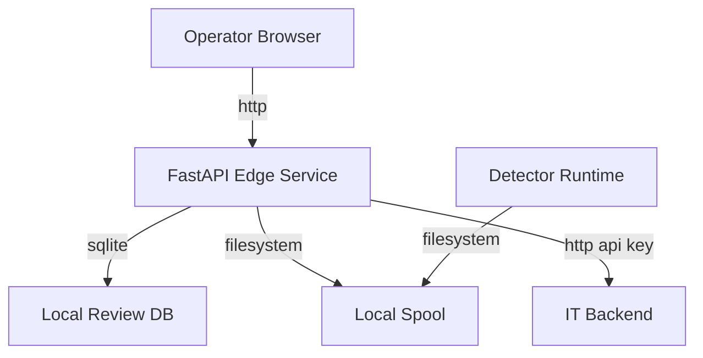

# Pedestrian Line Threat Model

## Executive summary

This repo's active production surface is the FastAPI-based edge service and the local detector/spool runtime, not the older `portal/` app. In the context you provided, the dominant risks are internal-network confidentiality failures and operator-scope bypasses: unauthenticated data APIs, over-broad static publication of spool contents, and storage/propagation of credential-bearing RTSP source values. Internet-originated attacks are out of scope for primary ranking because the service is intended to stay internal-only.

## Scope and assumptions

- In scope:
  - `pedestrian_line_counter/api.py`
  - `pedestrian_line_counter/service.py`
  - `pedestrian_line_counter/ui_auth.py`
  - `pedestrian_line_counter/traffic_spool.py`
  - `pedestrian_line_counter/event_uploader.py`
  - `pedestrian_line_counter/event_contract.py`
  - `pedestrian_line_counter/review_store.py`
  - `scripts/run_edge_service.sh`
  - `scripts/run_single_loop_live.sh`
  - `docs/jetson_dual_service_runbook.md`
- Out of scope:
  - The older `portal/` application as a production surface for this review.
  - Public internet exposure, CDN/WAF, and external reverse-proxy controls not represented in repo code.
- Assumptions:
  - The active deployment is the FastAPI edge service plus the detector/spool process, based on `plan.md` and your clarification.
  - The service may be reachable over an internal LAN, because the current runbooks document both loopback and LAN exposure modes.
  - Users are few and effectively admin/operators, but an internal workstation or service other than those admins may still have network reachability unless separately restricted.
  - RTSP source strings may contain credentials, because the documented configuration uses full RTSP URLs and the code persists raw `source_value`.

Open questions that would materially change risk ranking:

- Whether the service is actually deployed on `127.0.0.1` only, or bound to a LAN address.
- Whether network policy restricts reachability strictly to a small admin subnet.

## System model

### Primary components

- Detector/counting runtime
  - `pedestrian_line_counter/main.py`
  - Reads video or RTSP, detects/tracks/counts, writes spool artifacts.
- Local spool store
  - `pedestrian_line_counter/traffic_spool.py`
  - Stores `run.json`, `events.jsonl`, `status.json`, thumbnails, and reports on disk.
- FastAPI edge service
  - `pedestrian_line_counter/api.py`
  - Exposes operator UI, JSON APIs, retention actions, and sync actions.
- Local review store
  - `pedestrian_line_counter/review_store.py`
  - SQLite DB placed under the spool root by default.
- Delivery worker
  - `pedestrian_line_counter/event_uploader.py`
  - Reads spool runs and sends run/event/evidence payloads to the IT backend.

### Data flows and trust boundaries

- Operator browser -> FastAPI edge service
  - Data: login credentials, dashboard reads, event/review reads, review writes.
  - Channel: HTTP on loopback or LAN.
  - Security guarantees: optional UI cookie auth, `TrustedHostMiddleware` when configured, docs can be disabled, no rate limiting visible.
  - Validation: Pydantic models for JSON mutation payloads; manual parsing for HTML form posts.
- Detector runtime -> Local spool
  - Data: run metadata, event records, image evidence, health/status snapshots.
  - Channel: filesystem writes.
  - Security guarantees: local process boundary only; no encryption or access-control logic in repo code.
  - Validation: structured JSON writes, but source metadata is persisted largely as-is.
- FastAPI edge service -> Local spool
  - Data: run/event reads, evidence file serving, retention actions.
  - Channel: filesystem reads and deletes.
  - Security guarantees: app auth for some routes only; entire spool root mounted statically at `/evidence`.
  - Validation: JSON parsing for spool metadata; no per-file authorization boundary for static evidence.
- FastAPI edge service / uploader -> IT backend
  - Data: run payloads, event payloads, thumbnails.
  - Channel: outbound HTTP with `X-API-Key`.
  - Security guarantees: API key header; no TLS or endpoint policy visible in repo code.
  - Validation: response-shape checks exist in uploader flow.

#### Diagram

## Assets and security objectives

| Asset | Why it matters | Security objective (C/I/A) |
| --- | --- | --- |
| Evidence images (`thumbs/`, `scene/`) | Operational proof for vehicle crossings and human review | C, I |
| Spool metadata (`run.json`, `events.jsonl`, `status.json`, `report.csv`) | Encodes run history, event details, source metadata, and device state | C, I |
| RTSP/camera connection details | May include credentials or sensitive camera topology | C |
| Review DB (`.edge_ui_reviews.sqlite3`) | Contains operator review decisions and notes | C, I |
| Local mutation API key | Protects sync and retention actions when configured | C, I |
| UI admin credential / cookie session | Grants operator access to dashboard and review workflow | C, I |
| Jetson compute/storage budget | Needed for continuous inference and local service availability | A |

## Attacker model

### Capabilities

- Internal user on the corporate network who can reach the FastAPI service.
- Compromised internal workstation or internal web page loaded in an operator browser.
- Adjacent internal service that can make direct HTTP requests to the Jetson-hosted FastAPI app.

### Non-capabilities

- Unauthenticated internet attacker directly reaching the service from the public internet.
- Cross-tenant attacker; this is not a multi-tenant system.
- Local root access on the Jetson is not assumed by default, because that would dominate all app-layer risks.

## Entry points and attack surfaces

| Surface | How reached | Trust boundary | Notes | Evidence (repo path / symbol) |
| --- | --- | --- | --- | --- |
| `/api/auth/login` and `/ui/login` | Browser -> FastAPI | Operator browser to service | Shared local admin auth, no rate limit visible | `pedestrian_line_counter/api.py:1182`, `pedestrian_line_counter/api.py:1211` |
| Read APIs: `/status`, `/metrics`, `/config`, `/runs/recent`, `/events/recent`, `/events/{event_uid}` | HTTP GET | Internal client to service | Sensitive operational/data reads; mostly unauthenticated | `pedestrian_line_counter/api.py:1283`, `pedestrian_line_counter/api.py:1287`, `pedestrian_line_counter/api.py:1291`, `pedestrian_line_counter/api.py:1295`, `pedestrian_line_counter/api.py:1307`, `pedestrian_line_counter/api.py:1333` |
| Static `/evidence/*` | HTTP GET | Internal client to spool-backed static mount | Entire spool root is mounted, not just image subdirs | `pedestrian_line_counter/api.py:1164` |
| Review mutation routes | POST JSON / HTML form | Authenticated browser to service | Protected by UI auth cookie | `pedestrian_line_counter/api.py:1367`, `pedestrian_line_counter/api.py:1386` |
| Sync / retention mutation routes | POST JSON | Internal client to service | Protected only by mutation API key if configured | `pedestrian_line_counter/api.py:1562`, `pedestrian_line_counter/api.py:1577`, `pedestrian_line_counter/api.py:1589` |
| Spool writer | Detector runtime -> filesystem | Detector to local disk | Stores raw source metadata and evidence | `pedestrian_line_counter/main.py:1638`, `pedestrian_line_counter/traffic_spool.py:117` |
| Outbound uploader | Service/runtime -> backend | Edge service to IT backend | Sends `source_value`, events, thumbnails via API key | `pedestrian_line_counter/event_contract.py:60`, `pedestrian_line_counter/event_uploader.py:101` |

## Top abuse paths

1. Internal attacker reaches unauthenticated `/events/recent` or `/events/{event_uid}` -> enumerates event data and image URLs -> downloads evidence and review context -> confidentiality loss for operational traffic data.
2. Internal attacker requests predictable `/evidence/...` paths -> fetches spool files beyond images such as `run.json` or `.edge_ui_reviews.sqlite3` -> extracts run metadata, notes, and possible source credentials.
3. Internal attacker obtains `run.json` through the API or static mount -> reads `source_value` containing credential-bearing RTSP URL -> pivots to direct camera access or leaks camera credentials.
4. Internal attacker brute-forces the shared UI admin password over LAN -> gains dashboard/review access -> changes review decisions or reads protected UI pages.
5. Internal attacker repeatedly calls expensive spool-scanning endpoints -> drives repeated disk and JSON parsing on the Jetson -> degrades dashboard responsiveness and possibly inference-adjacent availability.
6. Internal attacker with leaked mutation API key calls `/retention/run` or `/sync/retry` -> manipulates local retention or upload behavior -> operational integrity and availability impact.

## Threat model table

| Threat ID | Threat source | Prerequisites | Threat action | Impact | Impacted assets | Existing controls (evidence) | Gaps | Recommended mitigations | Detection ideas | Likelihood | Impact severity | Priority |
| --- | --- | --- | --- | --- | --- | --- | --- | --- | --- | --- | --- | --- |
| TM-001 | Internal user or compromised internal host | Service is reachable over LAN or another reachable internal path | Query unauthenticated read APIs to enumerate runs, events, config, and evidence URLs | Confidential operational data disclosure and service reconnaissance | Evidence, spool metadata, review state, config | UI auth exists for HTML pages and review JSON only: `pedestrian_line_counter/api.py:1354`, `pedestrian_line_counter/api.py:1372`, `pedestrian_line_counter/api.py:1434` | Read APIs are not consistently authenticated | Require auth on all non-public runtime/data routes; default routers to protected | Log route hits for `/config`, `/events/*`, `/runs/*` and alert on non-operator sources | High | High | high |
| TM-002 | Internal user or compromised internal host | Knowledge or discovery of spool-relative paths; service can reach `/evidence` | Download arbitrary spool-backed files via the static mount | Direct exposure of evidence, run data, review DB, uploader state, and path metadata | Evidence, review DB, spool metadata | StaticFiles protects traversal but not over-publication: `pedestrian_line_counter/api.py:1164` | Whole spool root published instead of a narrow evidence surface | Replace static root mount with authenticated image-serving endpoints restricted to `thumbs/` and `scene/` | Log non-image `/evidence` requests and 200s for dotfiles/JSON/CSV/DB files | Medium | High | high |
| TM-003 | Internal user, adjacent service, or backend observer | Access to spool files, read APIs, or backend run payloads | Retrieve raw `source_value` and extract RTSP credentials or camera topology | Credential leakage and camera access pivot | RTSP credentials, camera inventory | Source value is persisted and forwarded: `pedestrian_line_counter/traffic_spool.py:124-126`, `pedestrian_line_counter/event_contract.py:88-89` | Raw source values are treated as normal metadata | Redact credentials before writing spool or contract payloads; store camera ID instead of raw URI | Alert on spool files or payloads containing `rtsp://` with `@` or credentials markers | Medium | High | high |
| TM-004 | Internal user or compromised internal host | Ability to send repeated login attempts | Brute-force the shared admin password | Unauthorized operator access | UI credential, operator session, review workflow | Cookie is `HttpOnly` and `SameSite=Lax`: `pedestrian_line_counter/api.py:1195-1202`, `pedestrian_line_counter/api.py:1237-1244` | No visible rate limiting, lockout, or per-user identity | Add login throttling and move to individual internal auth when available | Count failed logins per IP and username; alert on bursts | Medium | Medium | medium |
| TM-005 | Internal user or compromised internal host | Ability to repeatedly call expensive GET routes | Trigger repeated spool rescans and dashboard aggregations | Availability degradation on Jetson-local service | Jetson CPU, IO, service availability | None visible beyond request limits on query params | No rate limit, caching, or precomputed summaries | Add caching or prebuilt summaries; rate limit read-heavy routes | Monitor request volume and latency for `/status`, `/metrics`, `/events/recent`, `/ui/dashboard` | Medium | Medium | medium |
| TM-006 | Internal user with leaked mutation API key | Mutation API key exposed or shared | Invoke retention/sync endpoints to alter operational state | Integrity and availability impact to uploads and local retention | Mutation API key, spool integrity, upload state | Mutation auth exists when configured: `pedestrian_line_counter/api.py:1566`, `pedestrian_line_counter/api.py:1581`, `pedestrian_line_counter/api.py:1594`, `pedestrian_line_counter/api.py:1690-1705` | Key is coarse-grained and single-factor; some deployments may keep service loopback-only and disable it | Keep service loopback-only where possible; rotate keys; scope key distribution tightly | Log all mutation route calls with caller IP and route name | Low | High | medium |

## Criticality calibration

For this repo and your stated internal-only usage:

- `critical`
  - App-layer compromise that exposes RTSP credentials to broad internal users and enables direct camera takeover.
  - Unauthenticated mutation control that can delete retained evidence or corrupt operational delivery state across the device.
- `high`
  - Internal-network access to unauthenticated event/config/evidence reads.
  - Whole-spool publication that exposes review DB, event JSONL, and run metadata.
  - Leaking raw `source_value` containing credentials into spool artifacts and backend payloads.
- `medium`
  - Shared-admin password brute force on a LAN-exposed service.
  - Read-heavy endpoint abuse that degrades Jetson availability.
  - Mutation API key misuse after local leakage or over-sharing.
- `low`
  - Lack of reviewer identity attribution in the MVP review DB.
  - Minor service metadata leakage when the service is truly loopback-only.
  - Operational misconfigurations that do not cross trust boundaries on their own.

## Focus paths for security review

| Path | Why it matters | Related Threat IDs |
| --- | --- | --- |
| `pedestrian_line_counter/api.py` | Main trust boundary: auth, route exposure, static mount, mutation controls | TM-001, TM-002, TM-004, TM-005, TM-006 |
| `pedestrian_line_counter/_api_helpers.py` | Converts spool paths into public URLs and shapes externally visible event/run data | TM-001, TM-002 |
| `pedestrian_line_counter/ui_auth.py` | Session-token format and shared local UI auth model | TM-004 |
| `pedestrian_line_counter/service.py` | Deployment guardrails for loopback vs LAN exposure | TM-001, TM-006 |
| `pedestrian_line_counter/traffic_spool.py` | Writes sensitive run/event metadata and evidence to disk | TM-002, TM-003 |
| `pedestrian_line_counter/main.py` | Determines what source metadata enters the spool | TM-003 |
| `pedestrian_line_counter/event_contract.py` | Forwards run/event metadata to the backend contract | TM-003 |
| `pedestrian_line_counter/event_uploader.py` | Holds outbound API key flow and backend delivery behavior | TM-003, TM-006 |
| `pedestrian_line_counter/review_store.py` | Stores operator review data and notes in local SQLite | TM-002 |
| `scripts/run_edge_service.sh` | Encodes practical LAN vs loopback deployment defaults | TM-001, TM-006 |
| `scripts/run_single_loop_live.sh` | Controls spool generation and optional backend upload | TM-003 |
| `docs/jetson_dual_service_runbook.md` | Documents real deployment assumptions that affect threat likelihood | TM-001, TM-003 |

## Quality check

- Covered all discovered entry points: yes.
- Covered each major trust boundary at least once in threats: yes.
- Separated runtime behavior from the older portal stack and dev/test tooling: yes.
- Reflected user clarifications: yes, FastAPI-only and internal/admin-focused usage are incorporated.
- Made assumptions and open questions explicit: yes.

